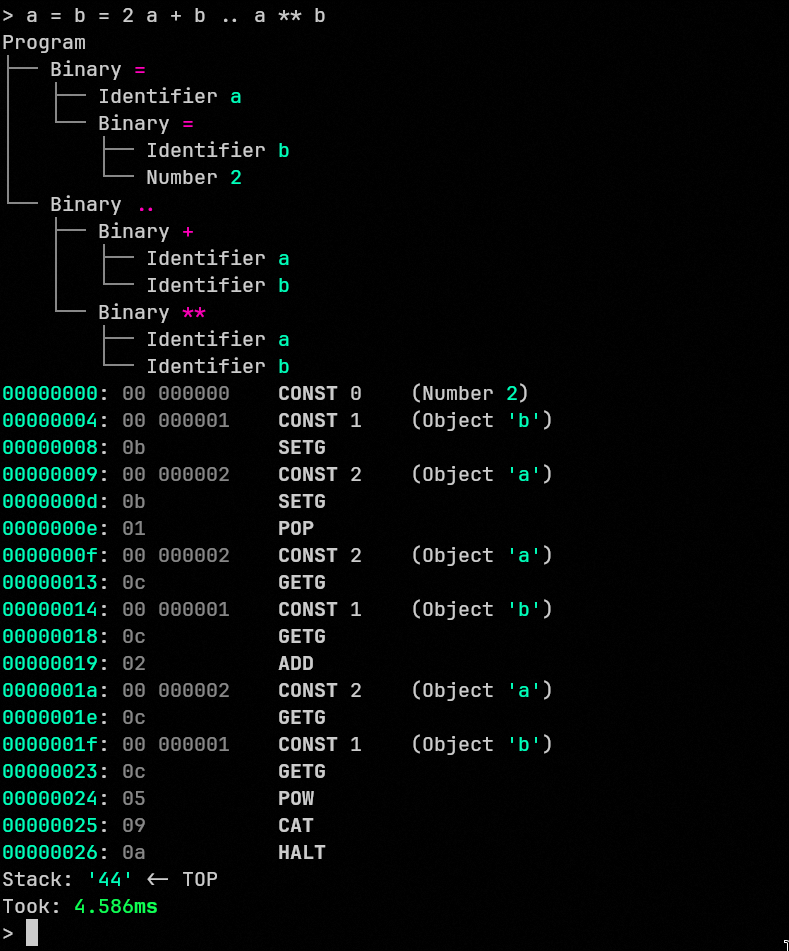

# Luna
An experimental scripting language written in Zig.

## Demo
Expression scanning, parsing, compiling and evaluating.


## Operators & Precedence
| Operators         | Associativity | Description |
|-------------------|---------------|-------------|
| `()`              |               | Grouping |
| `!` `-` `+`       | Right         | Unary |
| `**`              | Right         | Power |
| `*` `/`           | Left          | Multiplicative |
| `+` `-`           | Left          | Additive |
| `..`              | Left          | Concatenation |
| `<` `<=` `>` `>=` | Left          | Relational |
| `==` `!=`         | Left          | Equality |
| `&&`              | Left          | Logical AND |
| `\||`              | Left          | Logical OR |
| `=`               | Right         | Assignment |


## Grammar
```g4
grammar luna;

WHITESPACE
    : [ \t\n\r]+ -> skip
    ;

NUMBER
    : [0-9]+
    ;

STRING
    : '"'  ~'"'*  '"'
    | '\'' ~'\''* '\''
    ;

IDENTIFIER
    : [a-zA-Z_][a-zA-Z_0-9]*
    ;

program
    : statement* EOF
    ;

statement
    : expression
    | block
    ;

block
    : '{' statement* '}'
    ;

expression
    : assignment
    ;

assignment
    : logical_or
    | IDENTIFIER '=' assignment
    ;

logical_or
    : logical_and
    | logical_or '||' logical_and
    ;

logical_and
    : equality
    | logical_and '&&' equality
    ;

equality
    : relational
    | equality ( '==' | '!=' ) relational
    ;

relational
    : concatenative
    | relational ( '<' | '<=' | '>' | '>=' ) concatenative
    ;

concatenative
    : additive
    | concatenative '..' additive
    ;

additive
    : multiplicative
    | additive '+' multiplicative
    ;

multiplicative
    : power
    | multiplicative ( '*' | '/' ) power
    ;

power
    :  unary ( '**'  power )*
    ;

unary
    : ( '!' | '-' | '+' )? primary
    ;

primary
    : '(' expression ')'
    | ( 'null' | 'true' | 'false' | NUMBER | STRING | IDENTIFIER )
    ;
```

## Resources
* [Writing an Interpreter/Compiler in Go](https://interpreterbook.com/)
* [Crafting Interpreters](https://craftinginterpreters.com/)
* [Building the fastest Lua interpreter.. automatically!](https://sillycross.github.io/2022/11/22/2022-11-22/)
* [Building a baseline JIT for Lua automatically](https://sillycross.github.io/2023/05/12/2023-05-12/)
* [CS143 Compilers](https://web.stanford.edu/class/archive/cs/cs143/cs143.1128/)
* [Let's Build a Compiler](https://compilers.iecc.com/crenshaw/)
* [Programming languages resources](https://bernsteinbear.com/pl-resources/)
* [Simple Virtual Machine](https://www.bartoszsypytkowski.com/simple-virtual-machine/)
* [C# Language Specification](https://learn.microsoft.com/en-us/dotnet/csharp/language-reference/language-specification/readme)
* [Lua 5.1 Reference Manual](https://www.lua.org/manual/5.1/)
* [Top Down Operator Precedence](https://crockford.com/javascript/tdop/tdop.html)
* [Simple but Powerful Pratt Parsing](https://matklad.github.io/2020/04/13/simple-but-powerful-pratt-parsing.html)
* [Parsing Expressions by Recursive Descent](https://www.engr.mun.ca/~theo/Misc/exp_parsing.htm)
* [Notes on the Implementation of Lua 5.3](https://poga.github.io/lua53-notes/introduction.html)
